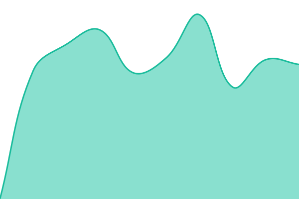
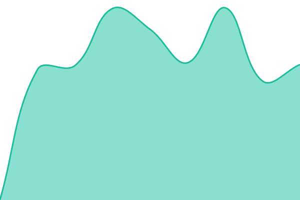

# [📈 Live Status](https://seodani.github.io/status): <!--live status--> **🟩 All systems operational**

This repository contains the open-source uptime monitor and status page for [seodani](danielstudio.kr), powered by [Upptime](https://github.com/upptime/upptime).

With [Upptime](https://upptime.js.org), you can get your own unlimited and free uptime monitor and status page, powered entirely by a GitHub repository. We use [Issues](https://github.com/seodani/status/issues) as incident reports, [Actions](https://github.com/seodani/status/actions) as uptime monitors, and [Pages](https://seodani.github.io/status) for the status page.

<!--start: status pages-->
<!-- This summary is generated by Upptime (https://github.com/upptime/upptime) -->
<!-- Do not edit this manually, your changes will be overwritten -->
<!-- prettier-ignore -->
| URL | Status | History | Response Time | Uptime |
| --- | ------ | ------- | ------------- | ------ |
|  [다니엘 스튜디오 (kr-central)](kr-central.danielstudio.kr) | 🟩 Up | [kr-central.yml](https://github.com/seodani/status/commits/HEAD/history/kr-central.yml) | 

 164ms
     
 | 

<a href="https://status.danielstudio.kr/history/kr-central">100.00%</a>
    

|  [다니엘 스튜디오 홈페이지](https://danielstudio.kr) | 🟩 Up | [다니엘-스튜디오-홈페이지.yml](https://github.com/seodani/status/commits/HEAD/history/다니엘-스튜디오-홈페이지.yml) | 

 1698ms
     
 | 

<a href="https://status.danielstudio.kr/history/다니엘-스튜디오-홈페이지">100.00%</a>
    

|  [다니엘 스튜디오 콘텐츠 서버](https://contents.danielstudio.kr) | 🟩 Up | [다니엘-스튜디오-콘텐츠-서버.yml](https://github.com/seodani/status/commits/HEAD/history/다니엘-스튜디오-콘텐츠-서버.yml) | 

 666ms
     
 | 

<a href="https://status.danielstudio.kr/history/다니엘-스튜디오-콘텐츠-서버">100.00%</a>
    

|  [다니엘 스튜디오 요리 레시피](https://cookrecipe.danielstudio.kr) | 🟩 Up | [다니엘-스튜디오-요리-레시피.yml](https://github.com/seodani/status/commits/HEAD/history/다니엘-스튜디오-요리-레시피.yml) | 

 626ms
     
 | 

<a href="https://status.danielstudio.kr/history/다니엘-스튜디오-요리-레시피">99.24%</a>
    

|  [다니엘 스튜디오 (kr-storage-01)](kr-storage-01.danielstudio.kr) | 🟩 Up | [kr-storage-01.yml](https://github.com/seodani/status/commits/HEAD/history/kr-storage-01.yml) | 

 161ms
     
 | 

<a href="https://status.danielstudio.kr/history/kr-storage-01">100.00%</a>
    

|  [다니엘 스튜디오 스토리지 서버](https://kr-storage-01.danielstudio.kr) | 🟩 Up | [다니엘-스튜디오-스토리지-서버.yml](https://github.com/seodani/status/commits/HEAD/history/다니엘-스튜디오-스토리지-서버.yml) | 

 582ms
     
 | 

<a href="https://status.danielstudio.kr/history/다니엘-스튜디오-스토리지-서버">100.00%</a>
    

|  [다니엘 스튜디오 (kr-edge-01)](kr-edge-01.danielstudio.kr) | 🟩 Up | [kr-edge-01.yml](https://github.com/seodani/status/commits/HEAD/history/kr-edge-01.yml) | 

 161ms
     
 | 

<a href="https://status.danielstudio.kr/history/kr-edge-01">100.00%</a>
    

|  [다니엘 스튜디오 새로운 콘텐츠 서버](https://new-contents.danielstudio.kr) | 🟩 Up | [다니엘-스튜디오-새로운-콘텐츠-서버.yml](https://github.com/seodani/status/commits/HEAD/history/다니엘-스튜디오-새로운-콘텐츠-서버.yml) | 

 627ms
     
 | 

<a href="https://status.danielstudio.kr/history/다니엘-스튜디오-새로운-콘텐츠-서버">100.00%</a>
    

<!--end: status pages-->

[**Visit our status website →**](https://seodani.github.io/status)

## 📄 License

- Powered by: [Upptime](https://github.com/upptime/upptime)
- Code: [MIT](./LICENSE) © [Anand Chowdhary](https://anandchowdhary.com)
- Data in the `./history` directory: [Open Database License](https://opendatacommons.org/licenses/odbl/1-0/)
